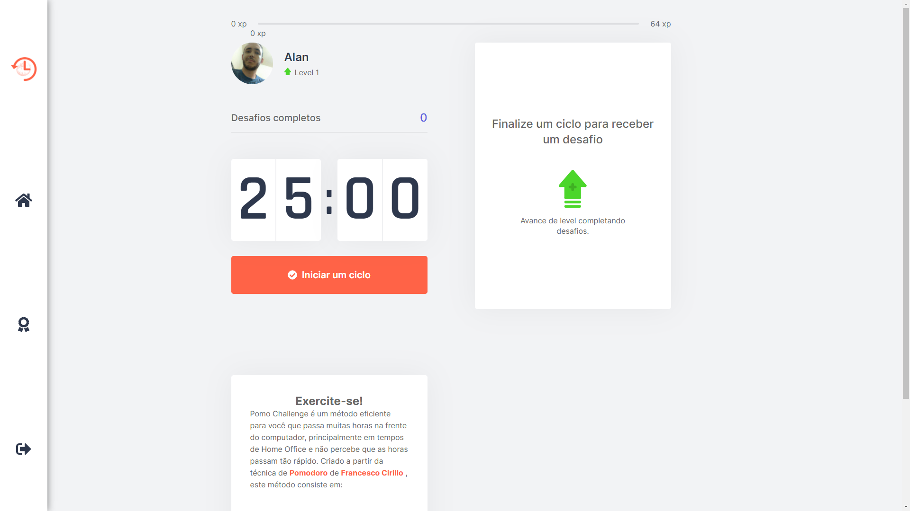

# Pomo Challenge
Aplição desenvolvida durante a semana da quarta edição da Next Level Week, promovida pela [Rocketseat](https://rocketseat.com.br/).

## Preview

# Como funciona:
É um método criativo baseado na técnica de gestão de tempo (Pomodoro), em que é iniciado um ciclo de 25 minutos pelo o usuário, para administrar suas atividades ao longo do dia.

Ao final do contador, o ciclo é interrompido e é disparado uma modal contendo um novo desafio, com instruções para exercícios para a visão e alongamentos. Caso Falhe, o contador é reiniciado, caso complete, o jogador ganha experiência como um sistema de gamificação e sobe de níveis, o que torna um incentivo a mais.

# Tecnologias Utilizadas

## Next.js
Neste projeto, foi utilizado <strong>Next.js</strong>, para melhor trabalhar com roteamento, interagindo com vários datos de diferentes rotas, mas em uma única página com <strong>SPA(Single Page Aplication)</strong>, além de <strong>SSR(Server Side Rendering)</strong> e <strong>SSG(Static Sit Generator)</strong>

## Context API
O mais recente método para aplicações React, permite passar os dados da aplicação de forma mais prática, sem a necessidade de usar `props` como parêmetro.

