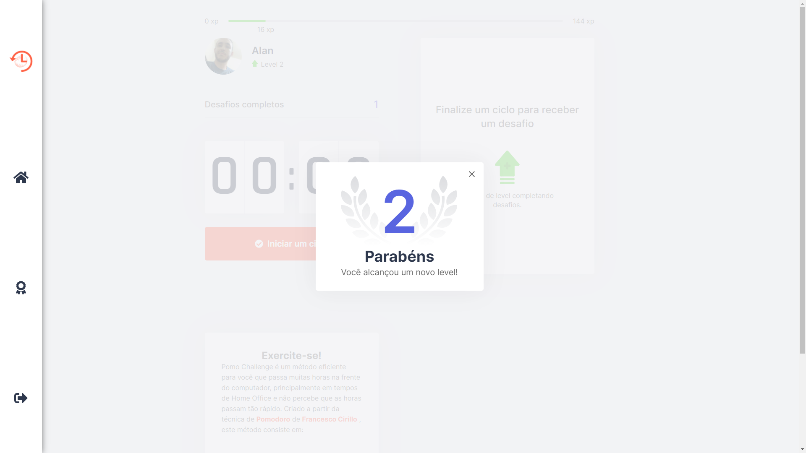

# Pomo Challenge
Aplição desenvolvida durante a semana da quarta edição da Next Level Week, promovida pela [Rocketseat](https://rocketseat.com.br/).

## 🚀 Preview 
### (Clique no botão abaixo para acessar a aplicação)
[](https://pomo-challenge.vercel.app/)




 # 📚 Como funciona:
É um método criativo baseado na técnica de gestão de tempo (Pomodoro), em que é iniciado um ciclo de 25 minutos pelo o usuário, para administrar suas atividades ao longo do dia.

Ao final do contador, o ciclo é interrompido e é disparado uma modal contendo um novo desafio, com instruções para exercícios para a visão e alongamentos. Caso falhe, o contador é reiniciado, caso complete, o jogador ganha experiência como um sistema de gamificação e sobe de níveis, o que torna um incentivo a mais.

# 🛠 Tecnologias Utilizadas

## Next.js
Neste projeto, foi utilizado [Next.js](https://nextjs.org), para melhor trabalhar com roteamento, interagindo com vários datos de diferentes rotas, mas em uma única página com <strong>SPA(Single Page Aplication)</strong>, além de <strong>SSR(Server Side Rendering)</strong> e <strong>SSG(Static Sit Generator)</strong>

## Typescript e Context API
[Typescript](https://www.typescriptlang.org) e [Context](https://reactjs.org/docs/context.html), o mais recente método para aplicações React, permite passar os dados da aplicação de forma mais prática, sem a necessidade de usar `props` como parêmetro.

## 🛠  Outras ferramentas

<strong>[Next Auth](https://next-auth.js.org/)</strong></br>
<strong>[React Loading](https://www.npmjs.com/package/react-loading)</strong>


# 🔥 Iniciando a Aplicação

## yarn

Clone o projeto para ter acesso

```bash
git clone https://github.com/alanhcrdz/pomo-challenge
```

```bash
#instalando as dependências
yarn
```

```bash
#iniciando o projeto
yarn dev
```
## npm


```bash
#instalando as dependências
npm install
```

```bash
#iniciando o projeto
npm run dev
```
<p align="center">Developeb by <a href="https://linkedin.com/in/alanharlen">Alan Harlen</a></p>


